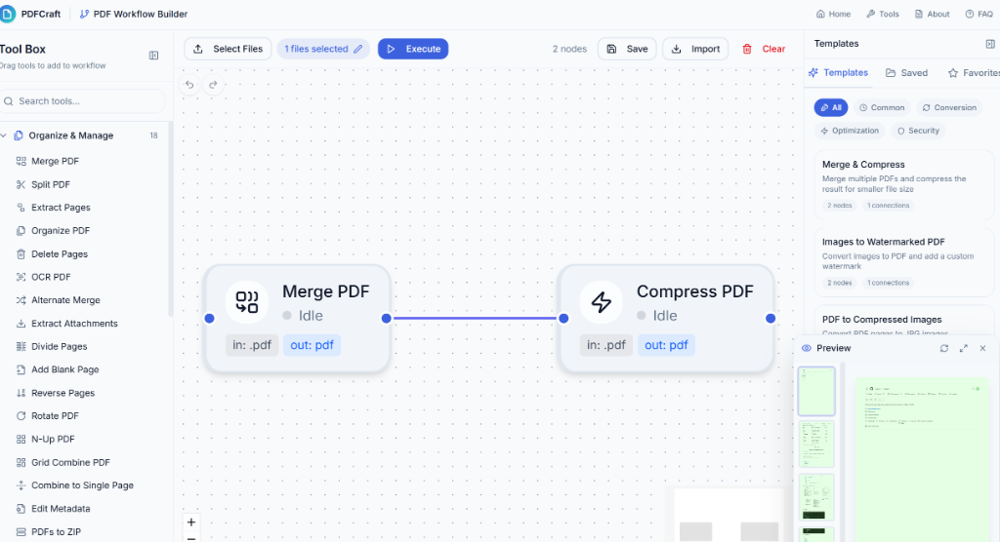

# PDFRuche 🌙

<div align="center">
  
  <h1>PDFRuche — Your PDF workspace, simplified</h1>
  <p>
    <strong>Free, Private & Browser-Based</strong>
  </p>
  <p>
    Merge, split, compress, convert, and edit PDF files online without uploading to servers.
  </p>
</div>

<div align="center">


</div>

> [!IMPORTANT]
> **PDFRuche** est basé sur le projet open source **[PDFCraft](https://github.com/PDFCraftTool/pdfcraft)** (AGPL-3.0).
> Voir [PDFRUCHE_MODIFICATIONS.md](PDFRUCHE_MODIFICATIONS.md) pour la déclaration des modifications.

## 📖 About

**PDFRuche** is a comprehensive suite of PDF tools designed for privacy and performance. Unlike many online converters, PDFRuche processes your files entirely within your browser using WebAssembly technology. Your documents **never** leave your device, ensuring maximum security for your sensitive data.

This project is built with modern web technologies to provide a slick, app-like experience directly in the browser.

## ✨ Key Features

- **🔒 100% Private**: All processing happens client-side. No file uploads to external servers.
- **🚀 Fast & Responsive**: Powered by Next.js and WebAssembly for near-native performance.
- **🛠️ Comprehensive Toolset**: Over 120 tools to handle any PDF task.
- **🎨 Modern UI**: Lunar-inspired design with a clean, accessible, responsive interface.
- **🌐 Multi-language**: 14 languages including English, French, Spanish, German, Japanese, Korean, and Chinese.

## 🧰 Tool Categories

| Category | Tools |
|----------|-------|
| **Edit & Annotate** | Edit PDF, Sign, Digital Sign, Watermark, Stamps, Forms, Crop, Page Numbers |
| **Convert to PDF** | Image to PDF, Word to PDF, Excel to PDF, PPTX to PDF, EPUB to PDF, and more |
| **Convert from PDF** | PDF to Image, PDF to DOCX, PDF to Excel, PDF to PowerPoint (PPTX) |
| **Organize & Manage** | Merge, Split, Organize, Delete, Rotate, Extract, Booklet, N-Up |
| **Optimize & Repair** | Compress, Rasterize, OCR, Repair, Linearize, Remove Blank Pages |
| **Secure PDF** | Encrypt, Decrypt, Change Permissions, Redact, Validate Signature |

## 🔄 Workflow Editor (Beta)

> ⚠️ **Early Development Notice**: This feature is currently in early development stage. You may encounter bugs or incomplete functionality. We appreciate your feedback and patience!

PDFRuche includes a powerful **visual workflow editor** that allows you to chain multiple PDF operations together, creating automated processing pipelines.

<div align="center">
  
  <p><em>Visual workflow editor with drag-and-drop interface</em></p>
</div>

Navigate to `/workflow` or click on "Workflow Editor" in the navigation menu.

## 💻 Tech Stack

- **Framework**: [Next.js 15](https://nextjs.org/) (App Router)
- **Language**: [TypeScript](https://www.typescriptlang.org/)
- **Styling**: [Tailwind CSS 4](https://tailwindcss.com/)
- **PDF Processing**:
  - [PDF.js](https://github.com/mozilla/pdf.js)
  - [pdf-lib](https://github.com/Hopding/pdf-lib)
  - [PyMuPDF (WASM)](https://pymupdf.readthedocs.io/)
  - [LibreOffice (WASM)](https://www.libreoffice.org/)
- **State Management**: [Zustand](https://github.com/pmndrs/zustand)
- **i18n**: [next-intl](https://github.com/amannn/next-intl) — 14 langues

## 🚀 Getting Started

### Prerequisites

- Node.js 18.17 or later
- npm, yarn, or pnpm

### Installation

1.  **Clone the repository**
     ```bash
      git clone https://github.com/biskerspe-crypto/PDFRuche.git
      cd PDFRuche
     ```

2.  **Install dependencies**
    ```bash
    npm install
    ```

3.  **Start the development server**
    ```bash
    npm run dev
    ```

4.  **Open your browser**
    Navigate to [http://localhost:3000](http://localhost:3000) to see the application running.

> 📖 **Instructions détaillées (installation, déploiement, AdSense, branding) : [PDFRUCHE_SETUP.md](PDFRUCHE_SETUP.md)**

## 📜 Scripts

- `npm run dev`: Starts the development server with Turbopack. Automatically runs `predev` to decompress LibreOffice WASM files.
- `npm run build`: Builds the application for production. Automatically runs `postbuild` to decompress WASM files in `out/`.
- `npm run start`: Starts the production server.
- `npm run lint`: Lints the code using ESLint.
- `npm run test`: Runs tests using Vitest.

## 🚀 Production Deployment

PDFRuche is configured for static export (`output: 'export'`), which means it can be deployed to any service that supports static website hosting without requiring a Node.js server.

> 📖 **For comprehensive deployment instructions, see [DEPLOYMENT.md](DEPLOYMENT.md)**

```bash
npm run build   # Static files generated in the `out` directory
```

- **Vercel**: `vercel --prod`
- **Netlify**: `netlify deploy --prod --dir=out`
- **Cloudflare Pages**: `wrangler pages deploy out`
- **Docker + Nginx**: `docker compose --profile prod up --build`

## 🤝 Contributing

Contributions are welcome! Please feel free to submit a Pull Request.

## 🤝 Acknowledgements

PDFRuche stands on the shoulders of giants:

- **[PDFCraft](https://github.com/PDFCraftTool/pdfcraft)** — the project PDFRuche is based on (AGPL-3.0)
- **[BentoPDF](https://github.com/alam00000/bentopdf)** — pioneering work in privacy-first, client-side PDF tools

## 📄 License

This project is licensed under the **AGPL-3.0-or-later** License - see the [LICENSE](LICENSE) file for details. PDFRuche is a modified version of **PDFCraft** (AGPL-3.0) — attribution and source availability obligations are preserved, see [PDFRUCHE_MODIFICATIONS.md](PDFRUCHE_MODIFICATIONS.md).
Corresponding Source for any network deployment is available at https://github.com/biskerspe-crypto/PDFRuche and via `/LICENSE` and `/source` on the deployed site (AGPL §13).

---

<div align="center">
  🌙 PDFRuche — based on <a href="https://github.com/PDFCraftTool/pdfcraft">PDFCraft</a> (AGPL-3.0)
</div>